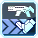

  

    <section>
    <h3 class="title">Overview</h3>
        
Rangers are the middle-ranged specialist attackers. They can deal impressive single target damage on foes by focusing on their weak spots, 
            and provide covering fire by clearing trash mobs with explosives. Their biggest asset, <a href="#" class="tooltip-link" data-toggle="tooltip" title="{{ site.data.glossary.weakbullet }}">Weak Bullet</a>, provides a massive damage enhancement that can quickly destroy bosses, if aimed right.
                                    If you spot something that is incorrect, send a Pull Request. If you don't know what that is,
            then I guess it's not being corrected now isn't it?

        
  

  </section>
  

  

  <section>	
      <h3>Weapon Overview</h3>
      

          The weapons used by Ranger are the Assault Rifle and Launcher:
              <ul>
                  <li>Assault Rifles are the middle-ranged, single target weapon, with noticeable charge times on their 2 powerful PAs that can quickly take down threats before they move. 
                      Rifle provides options for other situations as well like mobbing, but it’s not as strong as the Ranger’s secondary.
                  </li>
                  

                  <li>Launchers are the short ranged, AoE weapon that requires good positioning and aim to make the most out of their slow PAs. 
                      If done right however, Launchers will decimate mobs with ease. 
                  </li>
              </ul>						
      

      <table class="table table-responsive table-bordered">
          <thead>
              <tr>
                  <th scope="col">&nbsp;</th>
                  <th scope="col">Weapon</th>
                  <th scope="col">Description</th>
              </tr>
          </thead>
          <tbody>
              <tr>
                  <td></td>
                  <td>Rifle</td>
                  <td>Ranger's main bossing tool with a selection of tools for different enemy sizes. 
                                                          The main feat this weapon brings is powerhouse Photon Arts such as End Attraction and Satellite Cannon. 
                                                          It also has good sustain PAs like Parallel Slider-0 and Homing Emission for more mobile targets.    </td>
              </tr>
              <tr>
                  <td></td>
                  <td>Launcher</td>
                  <td>Absolutely a pocket nuke with some of the best mobbing capability in the game! 
                                                          Launcher is slower but with precision and precasting your PAs you can demolish enemies immediately on spawn or soon after.
                      Mowing down spawns with Sphere Eraser, dunking heads with Rodeo Drive-0 or sending bodies flying with Divine Launcher-0 can be quite addicting, 
                      just ask Fourier
                  </td>
              </tr>
          </tbody>
      </table>
  

  </section>
    

  

    <section>	
      <h3>Photon Arts</h3>
      
This section will list a handful of relevant PAs on their placement as a Ranger.

      <h4>Rifle Photon Arts</h4>
      <table class="table table-responsive table-bordered">
          <thead>
              <tr>
                  <th scope="col">&nbsp;</th>
                  <th scope="col" style="width:150px">Photon Art</th>
                  <th scope="col">Description</th>
              </tr>
          </thead>
          <tbody>
              <tr>
                  <td></td>
                  <td>End Attraction</td>
                  <td>A charged PA that deals huge amounts of damage, this is your main PA when you can’t use Satellite Cannon. 
                                                          However, it shares the same flaws with Satellite Cannon in that it has a limited range, and roots you in place while charging.
                                                          Aiming End Attract is very important; in the right position, you can hit weak spots on enemies multiple times..</td>
              </tr>
              <tr>
                  <td></td>
                  <td>Satellite Cannon</td>
                  <td>Quite literally a laser from the sky that rains damage upon a single position. A bit of a lengty charge similar to End Attract
                                                          with a better use against humanoid bosses like Flame Diamos or tiny weakpoints like Zeshrayda when toppled over. </td>
              </tr>
              <tr>
                  <td></td>
                  <td>Homing Emission & Type-0</td>
                  <td>The vanilla version requires manual aiming to lock on (up to) 6 targets,
                                                          which can be very tedious and impractical given what boss you're up against. Type-0 fires all 6 shots and has less PP cost, making its average damage output higher than vanilla.
                                                          It's your fastest PA used for Standing Snipe filler so best to get comfortable with it. </td>
              </tr>
              <tr>
                  <td></td>
                  <td>Parallel Slider & Type-0</td>
                  <td>Has i-frames on the twirl start up when crafted, quite useless vanilla due to type-0 having susatinability and movement.
                                                          One of more favored PAs when soloing bosses to deal damage on the go and set up Standing Snipe with i-frames.</td>
              </tr>
          </tbody>
      </table>
      <h4>Launcher Photon Arts</h4>
      <table class="table table-responsive table-bordered">
          <thead>
              <tr>
                  <th scope="col">&nbsp;</th>
                  <th scope="col" style="width:150px">Photon Art</th>
                  <th scope="col">Description</th>
              </tr>
          </thead>
          <tbody>
              <tr>
                  <td></td>
                  <td>Divine Launcher & Type-0</td>
                  <td>The big bad. Divine Launcher can almost send enemies to the heavens with the large AoE blast it has. Vanilla is just a non-chargable version,
                                                          while Type-0 gains a larger AoE and more damage. Precast for best effect and watch as you OHKO things even on XH difficulty. </td>
              </tr>
              <tr>
                  <td></td>
                  <td>Sphere Eraser</td>
                  <td>Think AIS laser but drains your PP very quickly. Has a low turning speed so its most wisely used when mowing down spawns or limited moving / stationary targets.
                                                          It's good DPS for the amount of time it takes to use. </td>
              </tr>
              <tr>
                  <td></td>
                  <td>Concentrate One</td>
                  <td>Simple triple shot PA with excellent range and good PP efficiency. Mainly used to take care of mobs quicker than an overkill Divine Launcher.
                                                          With it's simplicity and range, it's a common favorite when conserving PP during mobbing.</td>
              </tr>
              <tr>
                  <td></td>
                  <td>Rodeo Drive and Type-0</td>
                  <td>Dunk on enemies with type-0 and zoom ahead of MPAs with this excellent travelling PA. It powers up after about 2 seconds,
                                                          noted by a larger spark when flying. Vanilla just does a little burnout you can brag about to your friends when you hit the car meetup on Tuesday nights, but pointless otherwise.</td>
              </tr>
          </tbody>
      </table>
      

  </section>
  

  

        <section>
            <h3>Skill Tree</h3>
                
The Skill Tree of a Ranger is a very simple tree compared to the other classes in the game. Upon leveling Ranger, you are given the following Skills at no addtional SP cost:

            <ul>
                <li>First Blood - Treats the first attack as a Just Attack, Techniques do not apply.</li>
                <li>Air Reversal - Enables you to do a Just Reversal midair.</li>
                <li>Just Reversal JA Combo - Grants a JA ring upon performing a Just Reversal.</li>
                <li>Next Jump - Allows you to double jump.</li>
            </ul>
            
Aside from these Skills, placing levels into Ranger will give access to more Skill Points, thus allowing you to access more Skills on the Skill Tree.

        </section>
        
Core skills from the Ranger tree are as followed. These are the skills you'll want to take as soon as possible. Prioritize them first!

        <section>
        <table class="table table-responsive table-bordered">
            <thead>
                <th scope="col">Skill Name</th>
                <th scope="col">Description</th>
            </thead>
                <tbody>
                    <tr>
                        <td> Weak Hit Advance 1 & 2</td>
                        <td>Increases your damage when attacking weak points. This synergizes with Weak Bullet and is a large chunk of where your damage come from.
                            Native weakpoints work as well such as enemies with headshot multipliers. </td>
                    </tr>
                    <tr>
                        <td> Standing Snipe 1 & 2</td>
                        <td>Needed moreso on rifle than launcher, it's another large increase in your damage when standing still. </td>
                    </tr>
                    <tr>
                        <td> Tactics Trap, Stun Grenade, Gravity Bomb & Upper Trap</td>
                        <td>With Tactics Trap allowing traps to regen PP on hit, Stun and Upper becomes on-demand sources of PP regen and help lower your downtime considerably.
                            Gravity Bomb is good crowd control with the ability to suck mobs in. </td>
                    </tr>
                    <tr>
                        <td> Moving Snipe</td>
                        <td>Increases damage when moving. This activates when you walk, jump, fall, etc before an attack.</td>
                    </tr>
                    <tr>
                        <td> Sharp Shooter</td>
                        <td>Increases your damage when attacking from a distance: around 2 dive rolls.</td>
                    </tr>
                    <tr>
                        <td> Weak Bullet</td>
                        <td>Loads (up to) 6 bullets that increases the Part Damage Modifier (PDM) by 120%, essentially making that part take 20% more damage.
                            There is no reason not to take this and max it, but learning how to use it properly has it's own learning curve. </td>
                    </tr>
                    <tr>
                        <td> PP Save Bullet</td>
                        <td>Reduces PP consumption of PAs and Technics by 20% when any bullet is loaded. If a rifle bullet is loaded the effect is only available for rifles, same for launcher. Pretty neat, isn't it?</td>
                    </tr>
                </tbody>
        </table>
        

        </section>