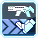
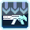

<h1 class="mt-2">Photon Arts</h1>
<section class="row">
	

		<h3>Suggested Photon Arts</h3>
		

			Note that these are only suggestions, you are encouraged to try out all the Ranger Photon Arts (PAs).
		

	

</section>
<section class="row">
	

		<h3>What is Type-0?</h3>
		

			Type-0 refers to crafting PA disks accessible through the My Room terminal, which can be done at any level:
		

		

			

				
			

			

				 
			

		

		

			They are also purchasable through the Player Shops, through the Visiphone:
		

		

			

				
			

			

				 
			

			

				
			

		

	

</section>
<section class="row">
	

		<h3>For Assault Rifles:</h3>
		<dl class="row">
			<dt class="col-sm-3">
				&nbsp;Satellite Cannon
			</dt>
			<dd class="col-sm-9">A PP-efficient boss killer, best used for when a boss is about to be stunned.</dd>
		</dl>
		<dl class="row">
			<dt class="col-sm-3">
				&nbsp;End Attract
			</dt>
			<dd class="col-sm-9">Your main boss killer, used to burst down bosses as it hits numerous times. Has 2 charge levels.</dd>
		</dl>
		<dl class="row">
			<dt class="col-sm-3">
				&nbsp;Parallel Slider Type-0
			</dt>
			<dd class="col-sm-9">Used for avoiding attacks (the start-up has invincibility frames), and kiting/chasing fast moving targets.</dd>
		</dl>
		<dl class="row">
			<dt class="col-sm-3">
				&nbsp;Impact Slider
			</dt>
			<dd class="col-sm-9">A gap-closer that’s highly spammable and deals surprisingly good damage; the ending kick should be canceled immediately as it deals pitiful damage.</dd>
		</dl>
		<dl class="row">
			<dt class="col-sm-3">
				&nbsp;Piercing Shell
			</dt>
			<dd class="col-sm-9">Fast filler DPS on stationary targets when you’re 2+ dive rolls away; must be used in the air for best effect.</dd>
		</dl>
	

</section>
<section class="row">
	

		<h3>For Launchers:</h3>
		<dl class="row">
			<dt class="col-sm-3">
				&nbsp;Divine Launcher Type-0
			</dt>
			<dd class="col-sm-9">Your main AoE PA, demolishes anything caught within its huge blast radius.</dd>
		</dl>
		<dl class="row">
			<dt class="col-sm-3">
				&nbsp;Rodeo Drive Type-0
			</dt>
			<dd class="col-sm-9">Primarily used to travel long distances.</dd>
		</dl>
		<dl class="row">
			<dt class="col-sm-3">
				&nbsp;Cosmos Breaker
			</dt>
			<dd class="col-sm-9">Used to keep dangerous targets hit-stunned; highly spammable at close range and aimed at the ground.</dd>
		</dl>
		<dl class="row">
			<dt class="col-sm-3">
				&nbsp;Sphere Eraser
			</dt>
			<dd class="col-sm-9">Clears lines of enemies, mostly used as a last resort on bosses.</dd>
		</dl>
		<dl class="row">
			<dt class="col-sm-3">
				&nbsp;Concentrate One
			</dt>
			<dd class="col-sm-9">A PP-efficient PA used to kill remaining mobs, or hitting precise weak spots.</dd>
		</dl>
	

</section>
<section class="row">
	

		
All of these PAs can be purchased through the Player Shops (purple terminal). Some of these PAs are purchasable through the Photon Shop on the 2nd floor of the Shopping District.

		
<a href="#">Gearing up for those wanting to skip the PA section.</a>

	

</section>

<section class="row">
	

		<h1>Assault Rifle PAs</h1>
	

	<article>
		

			<h3> Piercing Shell</h3>
			
Your most basic projectile PA; fires a shot that pierces.

			
		

		

			
<strong><a href="http://bumped.org/psublog/sept-27th-2017-balance-changes/" target="_blank">9/27/2017 adjustments</a></strong>

			
<strong><a href="https://www.bumped.org/psublog/episode-6-balance-adjustments/" target="_blank">4/24/2019 adjustments</a></strong>

			
Rating: <b>4/5</b>

			

				Faster whilst midair and gaining Standing Snipe benefits, Piercing Shell is the answer to thicker targets as it
				can be quite an efficient way to mow down mini-bosses, or on parts where the lingering projectile can hit twice; 
				essentially, the double-hit property is the only way this PA becomes notable. 
				A video showcasing Piercing Shell’s time-to-kill versus other rifle PAs can be seen <a href="https://www.youtube.com/watch?v=zxruPkNz81M">here</a>.
			

		

	</article>
	<article>
		

			<h3> Grenade Shell</h3>
			
Shoots an explosive shell.

			
		

		

			
Rating: <b>2/5</b>

			

				Grenade Shell’s AoE is very small and the damage isn’t very impressive.
				Launchers, or other Rifle PAs handle quick mobbing better.
				Other than providing a fast way to stay suspended midair and procc 
				<strong>Tech Arts JA Bonus / PP Save</strong>, this PA doesn’t do anything spectacular.
			

			

				The <a href="http://bumped.org/psublog/sept-27th-2017-balance-changes/">9/27/2017 adjustments</a> hasn’t helped this PA, so there are no adjustments to the rating.
			

			

				<a href="https://www.bumped.org/psublog/episode-6-balance-adjustments/">4/24/2019 adjustments</a> turns Grenade Shell into a filler for aerial Standing Snipe or JA bonuses.
			

		

	</article>
	<article>
		

			<h3> One Point</h3>
			
Fires a barrage of bullets onto the enemy.

			
		

		

			
<strong><a href="http://bumped.org/psublog/sept-27th-2017-balance-changes/" target="_blank">9/27/2017 adjustments</a></strong>

			
<strong><a href="https://www.bumped.org/psublog/episode-6-balance-adjustments/" target="_blank">4/24/2019 adjustments</a></strong>

			
Rating: <b>4/5</b>

			

				Recent buffs to One Point (yet again) turns it into a better DPS PA now, even beating out Parallel Slider Type-0 in certain cases!
				Additionally, aerial One Point can now activate Standing Snipe, making this a great choice for general damage usage.
			

			
One Point shines much better on bosses that are moving too fast, which would make it ideal over using Satellite Cannon and End Attract.

		

	</article>
	<article>
		

			<h3> Diffuse Shell</h3>
			
Fires a close ranged blast.

			
		

		

			
Rating: <b>3.5/5</b>

			

				<strong><a href="http://bumped.org/psublog/sept-27th-2017-balance-changes/" target="_blank">9/27/2017 adjustments</a></strong>: Diffuse Shell is still a filler PA for Standing Snipe and JA bonuses. 
				It can now be canceled early, and has a noticeable damage buff, but it still has that post-firing delay which makes it awkward to spam. 
				A showcase of Diffuse Shell’s time-to-kill against other rifle PAs can be found <a href="https://www.youtube.com/watch?v=zxruPkNz81M" target="_blank">here</a>.
			

			
<strong><a href="https://www.bumped.org/psublog/episode-6-balance-adjustments/" target="_blank">4/24/2019 adjustments</a></strong>: Aerial Diffuse Shell can now activate Standing Snipe, but is still awkward to use in most cases.

		

	</article>
	<article>
		

			<h3> Homing Emission (and Type-0)</h3>
			
Fires up to 6 homing projectiles onto enemies.

			
		

		

			
<strong><a href="http://bumped.org/psublog/sept-27th-2017-balance-changes/" target="_blank">9/27/2017 adjustments</a></strong>

			
Rating: <b>4/5</b>

			

				Homing Emission used to be for bossing, but now <b>Satellite Cannon</b> and <b>End Attract</b> exists which replaces Homing Emission. 
				However, the short firing animation makes it perfect for Standing Snipe & JA bonuses, <a href="#" target="_blank">as explained in the Tips & Tricks section</a>.
			

			
Type-0 turns Homing Emission into a PP dump on bosses with narrow hitboxes. A showcase of HE0’s time-to-kill against other rifle PAs can be found <a href="https://www.youtube.com/watch?v=zxruPkNz81M" target="_blank">here</a>.

		

	</article>
	<article>
		

			<h3> Impact Slider</h3>
			
Slides towards the enemy with a barrage of shots.

			
		

		

			
Rating: <b>4/5</b>

			

				Impact Slider’s latest buff has made it more applicable in more situations now, as you can control the distance with movement keys. 
				A small note is that letting the kick whiff then firing a normal or special bullet activates <b>Standing Snipe</b>. 
				It’s invincibility starts as soon as you slide and ends at the start of the kick.
			

			
Impact Slider’s power was buffed in <strong><a href="http://bumped.org/psublog/sept-27th-2017-balance-changes/" target="_blank">9/27/2017 adjustments</a></strong>, 
			in <a href="http://www.bumped.org/psublog/pso2-jp-maintenance-and-patch-12-06-2017/" target="_blank">12/06/2017</a>,
			<a href="https://www.bumped.org/psublog/episode-6-balance-adjustments/" target="_blank">4/24/2019</a>, and in <a href="https://www.bumped.org/psublog/july-10th-2019-balance-adjustments/" target="_blank">07/10/2019</a>.

		

	</article>
	<article>
		

			<h3> Sneak Shooter</h3>
			
Fires a crouched shot that travels fast.

			
		

		

			
<strong><a href="http://bumped.org/psublog/sept-27th-2017-balance-changes/" target="_blank">9/27/2017 adjustments</a></strong>

			
Rating: <b>4/5</b>

			

				Sneak Shooter is a nice PA for fast, quick damage, and makes it ideal for breaking parts.
			

			
<b>As of Episode 5</b>, Sneak Shooter gains invincibility frames at the beginning, and ends when you shoot or when you start crawling.

			
<a href="http://bumped.org/psublog/sept-27th-2017-balance-changes/" target="_blank">9/27/2017</a> and <a href="https://www.bumped.org/psublog/july-10th-2019-balance-adjustments/" target="_blank">07/10/2019</a> adjustments buffs Sneak Shooter’s damage.

		

	</article>
	<article>
		

			<h3> Glorious Rain</h3>
			
Fires a hail of bullets that rain on your spot.

			
		

		

			
<strong><a href="http://bumped.org/psublog/sept-27th-2017-balance-changes/" target="_blank">9/27/2017 adjustments</a></strong>

			
Rating: <b>2.5/5</b>

			

				Glorious Rain has some specific usages, such as positioning yourself 
				above enemies while they try to hit you from below, otherwise most enemies will run out of the AoE.
			

		

	</article>
	<article>
		

			<h3> Parallel Slider</h3>
			
Performs a evasive maneuver while shooting bullets.

			
		

		

			
<strong><a href="http://bumped.org/psublog/sept-27th-2017-balance-changes/" target="_blank">9/27/2017 adjustments</a></strong>

			
Rating: <b>1/5</b>

			

				The post-firing delay is long, the damage is lackluster, and the animation doesn’t give you invincibility frames. Just get the Type-0 craft.
			

		

	</article>
	<article>
		

			<h3> Parallel Slider Type-0</h3>
			
When held, allows you to move while shooting bullets. Drains PP while held.

			
		

		

			
<strong><a href="http://bumped.org/psublog/sept-27th-2017-balance-changes/" target="_blank">9/27/2017 adjustments</a></strong>

			
<strong><a href="https://www.bumped.org/psublog/july-10th-2019-balance-adjustments/" target="_blank">07/10/2019 adjustments</a></strong>

			
Rating: <b>5/5</b>

			

				Parallel Slider Type-0 is the craft you need to survive most, if not all attacks thrown at you, because:
				<ol>
					<li>The starting animation makes you invincible until you start shooting, and</li>
					<li>You can safely kite out of an enemy’s range while dealing damage.</li>
				</ol>
				Parallel Slider-0’s damage is great for sustaining DPS, but for bursting look into using <b>Satellite Cannon</b> and <b>End Attract</b>.
			

		

	</article>
	<article>
		

			<h3> Satellite Cannon</h3>
			
When fully charged, launches a orbital strike at the indicated location.

			
		

		

			
<strong><a href="http://bumped.org/psublog/sept-27th-2017-balance-changes/" target="_blank">9/27/2017 adjustments</a></strong>

			
<strong><a href="https://www.bumped.org/psublog/july-10th-2019-balance-adjustments/" target="_blank">07/10/2019 adjustments</a></strong>

			
Rating: <b>5/5</b>

			

				There are some drawbacks to Satellite Cannon you should be aware of:
				<ul>
					<li>You need to charge for ~3 seconds (or 7 audible ticks) for Satellite Cannon to be at it’s strongest.</li>
					<li>You are rooted in place while charging, and the charge can be interrupted.</li>
					<li>It has a limited range, meaning that you can’t strike things from across the map.</li>
				</ul>
				Despite these drawbacks, Satellite Cannon is one of the best PA’s for Damage:PP spent.
			

			
If a boss won’t allow you to charge Satellite Cannon, the alternative is to use…

		

	</article>
	<article>
		

			<h3> End Attract</h3>
			
When fully charged, fires off a massive bullet that can pierce through targets.

			
		

		

			
Rating: <b>5/5</b>

			

				A quick charging PA that deals huge amounts of damage, and <a href="http://bumped.org/psublog/sept-27th-2017-balance-changes/" target="_blank">9/27/2017 adjustments improves EA’s damage by a lot</a>; 
				this is your main PA when you can’t use Satellite Cannon. However, it shares the same flaws with Satellite Cannon 
				in that it has a limited range, and roots you in place while charging.
			

			
Aiming End Attract is very important; in the right position, you can hit weak spots on enemies multiple times.

		

	</article>
</section>

<section class="row">
	

		<h1>Launcher PAs</h1>
	

	<article>
		

			<h3> Divine Launcher (and Type-0)</h3>
			
Fires a shot capable of mass destruction.

			
Type-0 allows you to charge the shot for additional range & damage.

			
		

		

			
Rating: <b>5/5</b>

			

				Divine Launcher is broken due to the large AoE and damage, and Type-0 and the <a href="http://bumped.org/psublog/sept-27th-2017-balance-changes/" target="_blank">9/27/2017 adjustments</a> greatly increases both aspects.
			

		

	</article>
	<article>
		

			<h3> Concentrate One</h3>
			
Fires 3 consecutive shots.

		

		

			
Rating: <b>3/5</b>

			
<a href="https://www.bumped.org/psublog/episode-6-balance-adjustments/">4/24/2019 adjustments</a>

			

				This being a PP efficient version of Divine Launcher, the fast shots allow you concentrate 
				damage on a weak spot, or distribute damage to other mobs. It’s range is the highest of any launcher PA, 
				making it useful for long distance snipes.
				The small AoE hurts this PA however, so use Divine Launcher T-0 if you need to cover a large area.
			

		

	</article>
	<article>
		

			<h3> Cluster Bullet</h3>
			
Fires a overhead shot that detonates over a small area.

		

		

			
<strong><a href="https://www.bumped.org/psublog/episode-6-balance-adjustments/" target="_blank">4/24/2019 adjustments</a></strong>

			
Rating: <b>3.5/5</b>

			

				A nice PA for spawn-camping and landing easy head shots, however Cluster Bullet
				is awkward to use in some situations, or against certain mobs that don’t have obvious head hitboxes.
			

		

	</article>
	<article>
		

			<h3> Cracker Bullet</h3>
			
Fires a shot that explodes numerous times.

		

		

			
Rating: <b>3/5</b>

			
<strong><a href="https://www.bumped.org/psublog/episode-6-balance-adjustments/" target="_blank">4/24/2019 adjustments</a></strong>

			

				Cracker Bullet can stick onto enemies with decent damage, and can travel much further than most PAs thanks to the 
				<a href="https://www.bumped.org/psublog/episode-6-balance-adjustments/" target="_blank">4/24/2019 adjustments</a>. 
				The final hit does much more damage than the first 12 and has a good amount of hit stun. 
				Paired with Cosmos Breaker it’s a deadly combination for up close damage.
			

		

	</article>
	<article>
		

			<h3> Zero Distance</h3>
			
Points your Launcher towards an enemy for a point-blank shot.

		

		

			
<strong><a href="http://bumped.org/psublog/sept-27th-2017-balance-changes/" target="_blank">9/27/2017 adjustments</a></strong>

			
Rating: <b>3.5/5</b>

			

				Using this at point blank causes your character to miss the PA so be aware of where you use it. 
				Its strong points being quick damage against grouped mobs, dealing decent damage and also being extremely 
				crafty at hitting enemies with rear weakspots then returning in front of them.
			

			
Paired with Cosmos Breaker and/or Cracker Bullet you can stagger enemies and put the barrel of your launcher straight in their face!

			
<a href="https://www.bumped.org/psublog/july-10th-2019-balance-adjustments/" target="_blank">07/10/2019 adjustments</a> adds super armor upon activation, making it safer to use.

		

	</article>
	<article>
		

			<h3> Rodeo Drive</h3>
			
Blasts a shot inside your Launcher to move forward. Deals damage on contact.

		

		

			
Rating: <b>1/5</b>

			

				Uncrafted Rodeo Drive was used for travelling and situational mobbing, but now Type-0 craft upgrades both of these functions.
			

		

	</article>
	<article>
		

			<h3> Rodeo Drive Type-0</h3>
			
When held, allows you to ride your Launcher like a bike. Deals damage on contact.

		

		

			
Rating: <b>5/5</b>

			

				Before the <a href="http://bumped.org/psublog/sept-27th-2017-balance-changes/" target="_blank">9/27/2017 adjustments</a>, 
				Rodeo Drive Type-0 was great for travelling; with the new PA buffs, Rodeo Drive T-0 is much better for travelling long distances while dealing damage.
			

		

	</article>
	<article>
		

			<h3> Crazy Smash</h3>
			
Swings your Launcher like a golf club to smash enemies away.

		

		

			
Rating: <b>2.5/5</b>

			

				Very rarely you’ll use this unless enemies get too close, however it’s one of the fastest ways to get a Just Attack bonus.
			

			
<a href="https://www.bumped.org/psublog/july-10th-2019-balance-adjustments/" target="_blank">07/10/2019 adjustments</a> adds super armor upon activation, making it safer to use.

		

	</article>
	<article>
		

			<h3> Fake Silhouette</h3>
			
Deploys a dummy that attracts enemies to it.

			
		

		

			
Rating: <b>2/5</b>

			

				 It’s hate value is less than that of War Cry so 90% of the time it doesn’t attract enemies as you’ll quickly override aggro, 
				 though has some merit via blocking enemy projectiles. Another use that is actually galactic brain is using it as a precast 
				 by setting up multiple dummies at once. Each dummy has around a 11 second timer before exploding and when stacked can do 
				 decent damage on weakpoints. Pretty much only used for spawn camping since the timer is so long.
			

		

	</article>
	<article>
		

			<h3> Flame Bullet</h3>
			
Turns your Launcher into a flamethrower.

		

		

			
<strong><a href="https://www.bumped.org/psublog/episode-6-balance-adjustments/" target="_blank">4/24/2019 adjustments</a></strong>

			
Rating: <b>4/5</b>

			

				<a href="https://www.bumped.org/psublog/july-10th-2019-balance-adjustments/" target="_blank">07/10/2019 adjustments</a> 
				adds super armor upon activation, making Flame Bullet a great PP-efficient option against mobs now. 
				Do note that you are forced to walk while channeling the attack.
			

		

	</article>
	<article>
		

			<h3> Cosmos Breaker</h3>
			
Fires a slow-moving projectile that detonates shortly after.

		

		

			
Rating: <b>5/5</b>

			

				A great PA that serves to stagger enemies and/or provide a PP efficient damaging tool. 
				Best used by firing the ball at point-blank, or towards the ground.
			

			

				<a href="https://www.bumped.org/psublog/july-10th-2019-balance-adjustments/" target="_blank">07/10/2019 adjustments</a> 
				adds super armor upon activation, making it safer to use.
			

		

	</article>
	<article>
		

			<h3> Sphere Eraser</h3>
			

				When held, fires a laser cannon that pierces through enemies.
			

		

		

			
Rating: <b>3.5/5</b>

			

				Used to be called PP Eraser due to its insane PP consumption, 
				<a href="http://bumped.org/psublog/sept-27th-2017-balance-changes/" target="_blank">9/27/2017 adjustments</a> has helped with reducing it’s cost, 
				making it more viable for situations.
			

			

				However a main issue with this PA is that it’s extremely slow to fire up, meaning that enemies will run away from it.
			

			

				<a href="https://www.youtube.com/channel/UCRctaO9Z2H3-Tg29Hmr55mw" target="_blank">PONTHI999</a> demonstrates using Sphere Eraser on spawning enemies (at 0:45):
			

			
		

	</article>
	
<a href="#">Gearing up</a>

</section>

