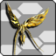

<h1 class="mt-2" data-toc-skip>Gearing Up</h1>

	<section class="col-12">
		<article class="pb-2">
			<h3 data-toc-skip>Ranger Gearing</h3>
			<h4 data-toc-skip>Is critical chance useful?</h4>
			
Credit goes to an anonymous reader for elaborating some points about critical chance.

			

				Yes and no. Weapons have a damage variance where you deal damage within a set range (95-97% is the minimum).
			

			

				In PSO2, criticals deal <strong>100%</strong> of your possible damage in that instance. 
				They are not <strong>150/200%</strong> more damage in other games that use critical chance (and by extension critical damage).
			

			

				In the case of <b>Ranger/Hunter</b> your average damage would increase if you stacked critical chance through various sources:
				<ul>
					<li><strong>+15%/+15/+12%</strong> from <a href="http://www.bumped.org/psublog/episode-5-s-class-abilities/">S-Class Abilities</a> (Wise Skill)</li>
					<li><strong>+50%</strong> from S4:Pursing Eclipse</li>
					<li><strong>+30%</strong> from Bouncer's Critical Field</li>
					<li><strong>+25%</strong> from Hunter's Fury Stance Critical</li>
					<li><strong>+20%</strong> from Techer's Shifta Critical</li>
					<li><strong>+20%</strong> from R/Critical Strike Shoot</li>
					<li><strong>+5%</strong> base</li>
				</ul>
				So while Ranger has a way to reach +100%, some of them are conditional 
				and/or requires you to give up some skills and/or certain S-class abilities.
			

			

				<strong>With the introduction of S4:Pursing Eclipse however,</strong> 
				Ranger <b>can</b> reach +100% critical chance without losing anything, 
				provided you are willing to sacrifice S4:Steadfast Courage for it.
			

			

				<b>However</b>, other subclasses like <strong>Phantom or Etoile</strong> allow Ranger to utilize crit without the need 
				of external critical rate boosters (Techer, Bouncer, etc) or SSAs like Wise Skill. 
				This allows Ranger to use SSAs like S3: Skilled Strike 2 (+5% critical damage) and have damage 
				scale up further when Shifta Critical and/or Critical Field are applied.
			

		</article>
		<article class="pb-2">
			<h3 id="mag">Mag</h3>
			

				A standard Ranger mag has +200 R-ATK, as shown below:
			

			
			

				<blockquote class="blockquote text-right">
					

						Start off by feeding your mag two 9* weapons of the ATK-type 
						(Ex: weapons with red background for S-ATK) you would want to level along with one 8★ 
						weapon of the same type, then wait until the energy of your mag is fully drained.						
					

					

						Proceed to feed it 3x 4★ (S-ATK), 5★ (R-ATK) or 6★ (T-ATK) furniture respectively. 
						This will give you the maximum of ATK and ensure you never gain a level of DEX. 
						<strong>(Furniture can be bought at the My Room Shop Attendant in back of the Shop Area or in player shops)</strong>
					

					<footer class="blockquote-footer">Nishikawa's advice on <cite title="Source Title">Efficient Feeding for Mags</cite></footer>
				</blockquote>
				As for Photon Blast choices, the only viable choices are Ketos Proi for its fast PP regeneration, 
				or Julius Nykta to help clear mobs via super suction effect.
			

			
Trigger Actions and Auto Actions are personal preference.

		</article>
		<article class="pb-2">
			<h3 id="Affixes">Affixes</h3>
			

				<b>This guide assumes you’ve understand what is affixing.</b> 
				<b>If not, go read <a href="https://tinyurl.com/gibmeplease" target="_blank">Princess Luna’s explanation on the affixing system in PSO2.</a></b>
			

			

				Aim for around <strong>1k+ HP, 160+ PP,</strong> and as much <strong>R-ATK as you can afford (minimum 100 R-ATK per unit and weapon)</strong> 
				on your affixes. For Ultra Hard content, a suggested baseline would be around <strong>1.3k+ HP and 175+ PP.</strong>
			

			

				Weapons have access to <strong><a href="https://pso2.arks-visiphone.com/wiki/Ability_Factors" target="_blank">Special Ability Factors</a></strong>, 
				granting you affixing options that may not be possible on Units.
			

			

				Affixes in bold are expensive and/or hard to acquire. 
				Affixes in italics are outdated. 
				As for what to put on, here’s some possible suggestions:
			

			

				<table class="table table-striped">
					<tbody>
						<tr>
							<th style="text-align:center;" colspan="3">Affixes</th>
						</tr>
						<tr>
							<th style="text-align:center;">Souls</th>
							<th style="text-align:center;" colspan="2">HP, R-ATK, PP</th>
						</tr>
						<tr>
							<td><strong>Astral Soul (If unit)&nbsp;</strong><a href="https://pso2.arks-visiphone.com/wiki/Ray_Sword">(SAF)</a></td>
							<td><strong>Yamato Factor</strong></td>
							<td>Shoot III | IV | <strong>V</strong> | <a href="https://pso2.arks-visiphone.com/wiki/Valkyrie_R25S" target="_blank" rel="noopener noreferrer">VI (SAF)</a></td>
						</tr>
						<tr>
							<td><em>Greuzoras Soul</em></td>
							<td>ARKS Max (2+ fever recipe)</td>
							<td>ARKS Fever</td>
						</tr>
						<tr>
							<td>Till the Soul</td>
							<td>Noble|Elegant<strong>|Grace Shoot | Grand Shoot</strong></td>
							<td>Persona Reverie / Apprezina Reverie</td>
						</tr>
						<tr>
							<td>Ares the Soul</td>
							<td><strong>Ether Factor</strong></td>
							<td><strong>Modulator</strong>&nbsp;<a href="https://pso2.arks-visiphone.com/wiki/Yasminkov_4000F" target="_blank" rel="noopener noreferrer">(SAF)</a></td>
						</tr>
						<tr>
							<td><em>Leopard / Siorg Soul</em></td>
							<td>Spirita III | IV | <strong>V</strong></td>
							<td>Stamina III | IV | <strong>V</strong></td>
						</tr>
						<tr>
							<td>Fang Soul</td>
							<td>St. Fever</td>
							<td><a href="https://pso2.arks-visiphone.com/wiki/Evleda_Tradir" target="_blank" rel="noopener noreferrer">Sentence Tiro</a> | <a href="https://pso2.arks-visiphone.com/wiki/Gix_Shadoke" target="_blank" rel="noopener noreferrer">Shoot</a>&nbsp;|<a href="https://pso2.arks-visiphone.com/wiki/Zeinesis_Calibur" target="_blank" rel="noopener noreferrer">Triple (SAF)</a></td>
						</tr>
						<tr>
							<td>Ex Ares the Soul</td>
							<td><strong>Doom Break III</strong></td>
							<td><b>Crack V</b></td>
						</tr>
						<tr>
							<td>Ex Til the Soul</td>
							<td><strong>EV Shoot HP | PP&nbsp;</strong></td>
							<td><strong>Mana Reverie</strong></td>
						</tr>
					</tbody>
				</table>
			

		</article>
		<article class="pb-2">
			<h3>Skill Rings</h3>
			<h4 id="essential">Essential</h4>
			<dl class="row">
				<dt class="col-sm-3"> L/L Non Weak Bonus</dt>
				<dd class="col-sm-9">
					
When using Launchers, Weak Hit Advance applies on non-weak areas equal to the ring’s level.

					
At +20, this ring makes it so Weak Hit Advance applies 100% on non-weak areas and makes Launchers overpowered, get it.

				</dd>
				
				<dt class="col-sm-3"> L/P Weak Bullet</dt>
				<dd class="col-sm-9">
					
Fired Weak Bullets becomes a hit-scan instead of a projectile.

					
A great quality of life ring; makes it so Weak Bullet can’t miss (and goes through walls) when you’re locked onto an enemy.

				</dd>
			</dl>
			<h4 id="recommended" class="pt-1">Recommended</h4>
			<dl class="row">
				<dt class="col-sm-3"> R/P Keeper Shoot</dt>
				<dd class="col-sm-9">
					
Grants a damage boost if your HP is above a certain threshold based on the ring’s level.

					
Nice 3% damage boost for Ranger.

				</dd>
				
				<dt class="col-sm-3"> R/Weak Hit PP Gain</dt>
				<dd class="col-sm-9">
					
Grants a bonus to PP gain when hitting weak spots based on the ring’s level.

					
A decent quality of life ring, helps with PP regen while spamming Dive Roll Shoot. 
					Needs +20 grind for best effect (+20% additional PP gained from weak hits).

					
Does not apply on <strong>spots marked by Weak Bullet.</strong>

				</dd>
				
				<dt class="col-sm-3"> L/ Atomizer Lovers</dt>
				<dd class="col-sm-9">
					
Speeds up animation speed of Atomizer-based items while increasing their healing effectiveness.

					
A great quality of life ring; spend less time throwing out a Moon/Star/Sol Atomizer while being completely invincible during the animation.

				</dd>
				
				<dt class="col-sm-3"> L/Jumping Dodge</dt>
				<dd class="col-sm-9">
					
Grants a usable ability that makes you jump straight up. Has 0.5s of i-frames while jumping.

					
Great ring to have for avoiding damage; needs to be +20 for best effect.

				</dd>
			</dl>
			<h4 id="niche" class="pt-1">Situational/Niche</h4>
			<dl class="row">
				<dt class="col-sm-3"> R/C Strike Shoot</dt>
				<dd class="col-sm-9">
					
Increases critical chance and critical damage for ranged damage.

					
Best paired with S4:Pursing Eclipse if you’re looking for a +100% critical chance set-up.

				</dd>
				
				<dt class="col-sm-3"> R/Effort Symbol Ra</dt>
				<dd class="col-sm-9">
					
Increases damage and Critical Hit Rate by a little while reducing damage taken. 
					Displays a visual effect in Quests. (<a href="https://pso2.arks-visiphone.com/wiki/Skill_Rings" target="_blank">Arks Visiphone</a>)
					

					
Only use if you don’t want to use the suggested rings above.

				</dd>
				
				<dt class="col-sm-3"> R/HP Restorate</dt>
				<dd class="col-sm-9">
					
Heals over time (7.50% of HP at +20) when your HP falls below a certain percentage. (100% at +20)

					
Mainly used if you’re not using Hunter subclass.

				</dd>
				
				<dt class="col-sm-3"> R/Tech Arts JAPPS</dt>
				<dd class="col-sm-9">
					
When alternating PAs with JAs, grants a PP cost reduction.

					
Great ring for conserving PP, but you do have traps to restore PP so not needed.

				</dd>
				
				<dt class="col-sm-3"> R/PP Convert</dt>
				<dd class="col-sm-9">
					
Grants the Techer’s active skill, PP Convert, which temporary decreases your max HP for increased PP regen.

					
Great ring for regenerating PP, but you do have traps to restore PP so not needed.

				</dd>

				<dt class="col-sm-3"> R/Massive Hunter</dt>
				<dd class="col-sm-9">
					
Grants the Hunter’s skill, Massive Hunter, which makes you immune to knockback and reduces damage taken.

					
Only use if your subclass is not Hunter.

				</dd>
				
				<dt class="col-sm-3"> L/Slow Dive Ring</dt>
				<dd class="col-sm-9">
					
Slows down your dive roll in exchange for increased i-frames based on the ring’s level.

					
Only use this if you have issues surviving; hurts your mobility otherwise.

				</dd>
				
				<dt class="col-sm-3"> L/Standing Sign</dt>
				<dd class="col-sm-9">
					
Shows a sign if Standing Snipe is activated.

					

						Only use this if you’re not familiar with Standing Snipe. 
						More detailed information on Standing Snipe and how to best utilize it can be found in <a href="tips-tricks.html" target="_blank">Tips & Tricks.</a>
					

				</dd>
				
				<dt class="col-sm-3"> L/A Launcher Mode</dt>
				<dd class="col-sm-9">
					
Changes Launcher’s normal attacks.

					
The fixed ranged and projectile changes makes it difficult to use in most cases.

				</dd>
			</dl>
		</article>
		<article class="pb-2">
			<h3>Weapons</h3>
			
<a class="text-warning" href="/weapons.html">Weapons are now on a separate section due to the amount of space it’s taking up!</a>

		</article>
		<article class="pb-2">
			<h3 id="units">Units</h3>
			<h4>What kind of units should I use at various levels?</h4>
			

				These are recommendations for Ranger units and does not cover every possible unit.
			

			

				
Level 1-50 (Entry level)

				

					<table class="align-self-center mr-3">
						<tbody>
							<tr>
								<td></td>
							</tr>
							<tr>
								<td></td>
							</tr>
							<tr>
								<td></td>
							</tr>
						</tbody>
					</table>
					

						<h5 class="mt-0"> Weapons Barrier</h5>
						

							Beginner’s unit set fit for every class. Gets quickly outdated at level 30+.
						

					

				
	
				
				
Level 50-75 (Middle-tier)
					
				

					<table class="align-self-center mr-3">
						<tbody>
							<tr>
								<td></td>
							</tr>
							<tr>
								<td></td>
							</tr>
							<tr>
								<td></td>
							</tr>
						</tbody>
					</table>
					

						<h5 class="mt-0"> Kaiser Set + Saiha Leg</h5>
						

							A great, balanced set that provides +150 HP (from Saiha leg), and +30 PP & +90 R-ATK (Kaiser Set).
						

						

							<strong>Do not craft these pieces, as it you will lose the hidden +150 HP and +30 PP stats.</strong>
						

					

				
	
				
				

					<table class="align-self-center mr-3">
						<tbody>
							<tr>
								<td></td>
							</tr>
							<tr>
								<td></td>
							</tr>
							<tr>
								<td></td>
							</tr>
						</tbody>
					</table>
					

						<h5 class="mt-0"> Stellar Wall</h5>
						

							A beginner’s  set that comes from Title Rewards (Reach level 75 on any class).								
						

					

				
	
				
				
Level 75+ (Endgame tier)

				

					At this point, you use whatever  or  units that would 
					best benefit you, as they all provide good individual bonuses. 
					 /  units do not come with a set. 
					The only  unit set that is somewhat usable is Austere, though it now has 
					a  upgrade.
				

				
For ideas on what to use, here are some suggestions:

				

					<table class="align-self-center mr-3">
						<tbody>
							<tr>
								<td></td>
							</tr>
							<tr>
								<td></td>
							</tr>
							<tr>
								<td></td>
							</tr>
						</tbody>
					</table>
					

						<h5 class="mt-0"> Lightstream Xion Series</h5>
						

							<strong>Obtained by upgrading a Celestial unit from DF: Persona EQ.</strong>
						

						

							Each piece provides <strong>+50 all ATK, +100 HP and +15 PP</strong>, making them highly desirable 
							as they offer great all-around stats and defenses.								
						

					

				
	
					
				

					<table class="align-self-center mr-3">
						<tbody>
							<tr>
								<td></td>
							</tr>
						</tbody>
					</table>
					

						<h5 class="mt-0"> Mask of Vain</h5>
						

							<strong>Drops from Omega Masquerade only.</strong>
						

						

							It’s a much more similar Allure Aid in terms of stats, but on the rear unit. 
							Offers <strong>+20 PP and +60 all ATK</strong> at the cost of no HP built-in.
						

					

				

									
				

					<table class="align-self-center mr-3">
						<tbody>
							<tr>
								<td></td>
							</tr>
						</tbody>
					</table>
					

						<h5 class="mt-0"> Rappy Shine</h5>
						

							<strong>Obtained from the Battle Arena shop.</strong>
						

						

							Boasting <strong>+777 HP</strong>, at the cost of offering 0 defenses, 
							Rappy Shine is usable if you really need the HP padding.
						

					

				

				
				

					<table class="align-self-center mr-3">
						<tbody>
							<tr>
								<td></td>
							</tr>
						</tbody>
					</table>
					

						<h5 class="mt-0"> Allure Aid</h5>
						
<strong>Drops from Level 81+ Omega Appregina only.</strong>

						

							The main appeal to this single unit is it offers <strong>+17 PP and +85 R-ATK</strong> to your stats. 
							Highly recommended to get one if you’re looking for purely offensive stats, but do note that it does not offer any HP.
						

					

				

				
				

					<table class="align-self-center mr-3">
						<tbody>
							<tr>
								<td></td>
							</tr>
							<tr>
								 <td></td>
							</tr>
							<tr>
								 <td></td>
							</tr>
						</tbody>
					</table>
					

						<h5 class="mt-0"> Izane Set</h5>
						
<strong>Drops from Level 71+ Thunder Izaneshi only.</strong>

						

							An insane set that has insane % defenses and <strong>+150 HP per piece (+450 HP total)</strong>, 
							but provides no PP. Usable still, though outclassed by the <strong>Novel</strong> series.
						

					

				

				
				

					<table class="align-self-center mr-3">
						<tbody>
							<tr>
								<td></td>
							</tr>
							<tr>
								 <td></td>
							</tr>
						</tbody>
					</table>
					

						<h5 class="mt-0"> Orgei Grudge &  Equdic Grudge</h5>
						

							<strong>Drops from Nemes Ange in Armada of Demise (Orgei). 
							Drops from Avar Nemesis in T: Scarlet Space Splitter (Equdic).</strong>
						

						

							Best offensive rear in the game, offering <strong>90 ATK, 40 HP and 10 PP.</strong> 
							Pretty much a better <strong>Mask of Vain</strong> as it has higher S/R/T resistances and 
							defenses only sacrificing 10pp when compared to it. 
							The  version supports S6 and has the same stats as Orgei.
						

					

				

			

		</article>
	</section>

