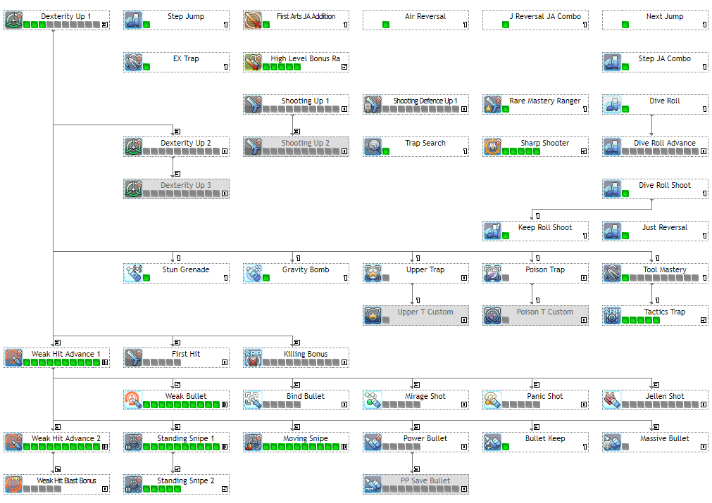

  

    <section>
    <h2 class="title">Skill Analysis</h2>
    <h3>Level 90 Cap</h3>
            
Ranger doesn’t have newer options with the additional 5 SP from Level 90 cap, but there are a few considerations (with their own pros and cons):

            <blockquote class="blockquote">
                <ul class="mb-0">
                    <li>[First Hit] is more effective when soloing, and has applications in multi-play/mobbing situations where the additional +20% damage would help one-shot enemies, but effectiveness lies on whether the player can plan in advance.</li>
                    <li>[Weak Hit Blast Bonus] synergizes well in mobbing situations, and especially with weapons that grant PB bonuses such as Ares and/or Austere. But, against raid bosses WHBB isn’t as effective.</li>
                    <li>[x Bullets] can activate PP Save Bullet on Launcher for 20% PP reduction; however procc’ing status with the bullets isn’t useful outside of extremely specific cases, and it may be difficult to activate Standing Snipe often while loaded with Launcher bullets.</li>
                </ul>
            <footer class="blockquote-footer text-center"><cite title="Source Title">Spin Cycle</cite></footer>
            </blockquote>
  

  </section>
  

  

    <section>
    <h3>Skill Priority</h3>
            
All credit goes to an anonymous reader for providing this suggestion:

            <blockquote class="blockquote text-center">
                

                Dive Roll Shoot > Weak Hit Advance 1 > Moving Snipe > Standing Snipe 1 to level 5 > Standing Snipe 2 to level 1 > 
                Stun Grenade & Gravity Bomb > Upper Trap <small>(Optional)</small> > Max Tactics Trap > Weak Bullet LV6 > Bullet Keep > Keep Roll Shoot
                

            </blockquote>
            
Then proceed to max out core skills.

  

  </section>
  

  

    <section>
    <h3>Core Skills</h3>
    
    
Above shown is the essential skills that every Ranger main should have. The breakdown on these skills:

  

  </section>
  

	<h2><i class="fas fa-chevron-circle-right"></i>Recommended Skills</h2>
	

	

    

          

              

                

                  
                

                

                  <h3>EX Trap</h3>
                

              

            
<b>Main class only</b>

            
Improves all trap’s range, speed and effectiveness, and provides certain effects for Poison Trap and Upper Trap.

            

              <iframe width="560" height="315" src="https://www.youtube.com/embed/kiUuPRI7gHA" frameborder="0" allow="accelerometer; autoplay; encrypted-media; gyroscope; picture-in-picture" allowfullscreen></iframe>
            

            
EX Trap effects:

              <ul>
                <li>All trap’s AoE range increases.</li>
                <li>Stun & Gravity Grenade’s animation sped up, throwing range & effectiveness improved.</li>
                <li>Upper Trap’s damage boosted by ~2.47x (~2.058x without 1 SP into Tool Mastery).</li>
                <li>Poison Trap applies a DoT which is ~1.563x of trap damage; not affected by Tool Mastery.</li>
                    </ul>
              
A free skill learned upon reaching level 85, and one that helps Rangers regen PP much better. <a href="http://pso2.swiki.jp/index.php?%E3%83%AC%E3%83%B3%E3%82%B8%E3%83%A3%E3%83%BC#EXtrap">JP Wiki Entry on EX Trap.</a>

            

           

          

              

                

                  
                

                

                  <h3>Rare Mastery Ranger</h3>
                

              

            
<b>Main class only</b>

            
<a href="http://bumped.org/psublog/sept-27th-2017-balance-changes/">9/27/2017 adjustments</a>

            
A passive skill that grants a 10% damage bonus for wearing 10★+ weapons. The skill is automatically learned and maxed at level 1.

            

           

          

              

                

                  
                

                

                  <h3>Dive Roll</h3>
                

              

            
Increases invincibility frames at the start of Dive Roll.

            
<b>0, 1 or 2 SP suggested.</b>

            
With the rise of Parallel Slider t-0 Dive Roll Advance isn’t necessary, but having points gives you room for avoiding attacks in a pinch.  Note that Dive Roll Advance is more preferred if not using Hunter subclass.

            

           

           

              

                

                  
                

                

                  <h3>Dive Roll</h3>
                

              

            
Increases invincibility frames at the start of Dive Roll.

            
<b>0, 1 or 2 SP suggested.</b>

            
With the rise of Parallel Slider t-0 Dive Roll Advance isn’t necessary, but having points gives you room for avoiding attacks in a pinch.  Note that Dive Roll Advance is more preferred if not using Hunter subclass.

            

           

      

    

  

