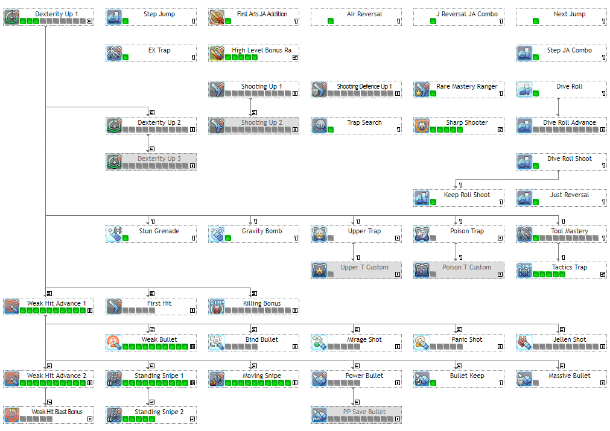

  

    <h3 class="title">Skill Analysis</h3>
    <section>
    <h4>Level 90 Cap</h4>
            
Ranger doesn’t have newer options with the additional 5 SP from Level 90 cap, but there are a few considerations (with their own pros and cons):

            <blockquote class="blockquote">
                <ul class="mb-0">
                    <li>[First Hit] is more effective when soloing, and has applications in multi-play/mobbing situations where the additional +20% damage would help one-shot enemies, but effectiveness lies on whether the player can plan in advance.</li>
                    <li>[Weak Hit Blast Bonus] synergizes well in mobbing situations, and especially with weapons that grant PB bonuses such as Ares and/or Austere. But, against raid bosses WHBB isn’t as effective.</li>
                    <li>[x Bullets] can activate PP Save Bullet on Launcher for 20% PP reduction; however procc’ing status with the bullets isn’t useful outside of extremely specific cases, and it may be difficult to activate Standing Snipe often while loaded with Launcher bullets.</li>
                </ul>
            <footer class="blockquote-footer text-center"><cite title="Source Title">Spin Cycle</cite></footer>
            </blockquote>
  

  </section>
  

  

    <section>
    <h3>Skill Priority</h3>
            
All credit goes to an anonymous reader for providing this suggestion:

            <blockquote class="blockquote text-center">
                

                Dive Roll Shoot > Weak Hit Advance 1 > Moving Snipe > Standing Snipe 1 to level 5 > Standing Snipe 2 to level 1 > 
                Stun Grenade & Gravity Bomb > Upper Trap <small>(Optional)</small> > Max Tactics Trap > Weak Bullet LV6 > Bullet Keep > Keep Roll Shoot
                

            </blockquote>
            
Then proceed to max out core skills.

  

  </section>
  

  

    <section>
    <h3>Core Skills</h3>
    
    
Above shown is the essential skills that every Ranger main should have. The breakdown on these skills:

  

  </section>
  

    

	<h2>Recommended Skills</h2>
	

	

		

		<section>
		<h3>EX Trap</h3>
		
<b>Main class only</b>

		
Improves all trap’s range, speed and effectiveness, and provides certain effects for Poison Trap and Upper Trap.

		<iframe width="560" height="315" src="https://www.youtube.com/embed/kiUuPRI7gHA" frameborder="0" allow="accelerometer; autoplay; encrypted-media; gyroscope; picture-in-picture" allowfullscreen></iframe>
		

		</section>
		

	

