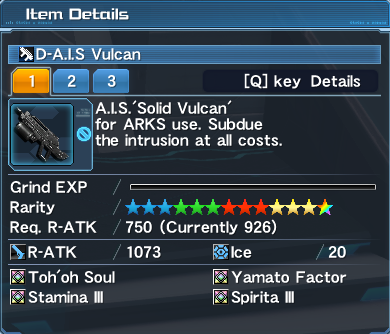
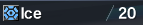
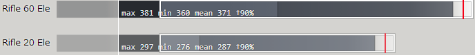
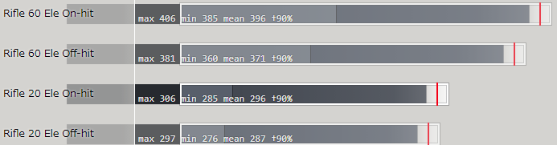

<h1 class="mt-2">Weapons</h1>

	<a href="#" class="list-group-item bg-primary-dark list-group-item-action flex-column align-items-start active">
		
<b>In every game you must upgrade your weapon for it to be strong! A +0 grind level, 20 element weapon isn’t going to do anything for you!</b>

		<small>Last updated on {{ page.last_update }}</small>
	</a>

<section class="mt-2 row">
	<article class="col-12">
		<h3>What’s the damage chart for Weapons?</h3>
		

			The following links contains rough estimates on weapons, and assumes that the weapon is +35, 
			and potentials such as the Fornis series matching element weaknesses are on. 
			This chart also assumes the best conditions for Rangers such as Standing Snipe, Sharp Shooter, etc. are activated. 
			An additional consideration is that these weapons are fully affixed; labels like <strong>DIM [170, 433]</strong> 
			denotes a +170 R-ATK affix with 4%/3%/3% <strong><a href="http://www.bumped.org/psublog/episode-5-s-class-abilities/">S-class abilities</a></strong> for example.
		

		

			<strong>Note that the damage chart only shows raw damage and does not consider realistic situations, 
			such as fighting bosses. Uses Piercing Shell notation for rifles and Concentrate One for launchers. 
			Overall multipliers used are from Hunter subclass.</strong>
		

		

			Thank you to <b>SCMSV (Spin)</b> for organizing these weapon tier lists.
		

		

			<a href="http://4rt.info/psod/?bvAYM" target="_blank" rel="noopener noreferrer">Link to Rifle chart</a>
		

		

			<a href="http://4rt.info/psod/?6Y0TK" target="_blank" rel="noopener noreferrer">Link to Launcher chart</a>
		
	
		

			The list takes min-maxing into account, thus the highest SSA damage %’s are used for applicable weapons. 
			Insight provided by <b>darkmark009</b> has led to setting base attack power at 2.5k, as:
			
			<blockquote class="blockquote text-right">
				

					There’s no way you’re going to have only 1.5k non-weapon attack, when you have [attack buffs such as] Shifta drink, 
					Shifta, team attack buff, not to mention units+timed abilities, and so on.
				

				<footer class="blockquote-footer">darkmark009</footer>
			</blockquote>
			Tweak the base ATP to see how weapons scale with higher/lesser stats.
		

	</article>
	<article class="mt-2 col-12">
		<h3>How important is elements on a weapon?</h3>
		

			Consider the following weapon:
		

		
		

			Although it looks strong, it’s actually quite weak. Take a closer look at the element value:
		

		
		

			Element value is an additional bonus (+xx%) to weapon’s attack, so using a PSO2 Damage Calculator, 
			20 element vs 60 element (60 element for  weapons only) would look like the following, 
			assuming everything is turned off (no Fury Stance, no anything):
		

		
		

			That’s a massive gap between the two! Element type is also important as it’s an additional +20% bonus 
			against enemies weak to your weapon, so <strong>on-element weakness vs off-element weakness & 20 element vs 60 element,</strong> 
			the damage calculator would look like this:
		

		
		
TL;DR: Weapon elements, both type and value, are very important in maximizing your damage.

		<h4 class="pt-2">What are the best elements for weapons?</h4>
		

			The best element for weapons is Light, due to important endgame bosses being weak to Light. 
			Every other element doesn’t matter as much, so you’re free to pick after having at least 1 good Light-element Rifle.
		

	</article>
	<article class="mt-2 col-12">
		<h3>Is crafting my old NT weapons worth it?</h3>
		

			Yes and no. Crafting just any NT weapon could result in you wasting millions of meseta and lots of time. 
			Ideally there are a handful of weapons (and/or) weapon series that are worth crafting. 
			To easily understand what’s worth crafting, it’s pretty much required that it’s within <strong>Austere-NT‘s</strong> 
			level of power when fully extended. Recommended weapons would be <strong>Invade-NT and Ceres</strong>, with some special cases 
			such as <strong>SSPN Launcher-NT and Dio Tigredor-NT</strong>.
		

		

			Crafting is generally very expensive and opens opportunities for multi-class weapons or just filling 
			in some empty gear spots. If you already have some of the endgame weapons such as <strong>Atlas Ex, Lightstream Xion 
			or Liberate series</strong>, take some time to evaluate if crafting is the right choice for you.
		

	</article>
	<article id="ssas" class="mt-2 col-12">
		<h3>What SSAs should I use on my weapons?</h3>
		

			SSA’s or Super Special Abilities  are capable of making a weapon 
			that supports them certainly viable via utility, damage or both. For Ranger, it’s suggested to find a balance between PP 
			and damage focused SSAs to get the best of both worlds.
		

		
		<h4 class="mt-2">S1 Abilities</h4>
		<dl class="row">
			<dt class="col-sm-3">Double-Edged Sword / 諸刃の撃</dt>
			<dd class="col-sm-9">
				
– Deal +4% more damage, but receive +8% more damage.

				
Self-explanatory given the name, popular SSA for those who want damage.

			</dd>
		
			<dt class="col-sm-3">Augment Intent / 錬成の志</dt>
			<dd class="col-sm-9">
				
– Increases Damage based on the amount of Special Abilities on the Weapon. Max: 4% (0.5% per ability).

				
Another 4% S1 that requires 8 slots to max.

				
Useful on weapons like Atlas Ex and Lightstream Xion weapons, among others with 3 or more SSA slots 
				due to the ease of making them 8s. At 7s it’s 3.5% which is fine, but other options like 
				Powering Intent might be better in the case you do less than 8s.

			</dd>
			
			<dt class="col-sm-3">Powering Intent / 強闘の志</dt>
			<dd class="col-sm-9">
				
– Deal +4% Damage against formidable enemies (bosses).

				
Good alternative to DES for rifle, seeing as you use it mainly on bosses.

			</dd>
			
			<dt class="col-sm-3">Lethal Intent / 死中の志</dt>
			<dd class="col-sm-9">
				
– Increases damage by 4%, but take 5% of your Max HP as damage every 20 seconds.

				
Works with Cursed Radiance for 15% PP every 20s, good if you can manage HP.

				
Can be bought on the player shops or dropped in Endless Quest as a capsule.

			</dd>
			
			<dt class="col-sm-3">Shoot Boost / 射撃増幅</dt>
			<dd class="col-sm-9">
				
– +1% Damage for every 60 R-ATK affixed onto your weapon, gain +2% Damage more at 200 R-ATK.

				
SSAF of the Lightstream Xion (R-ATK) weapons and Gunslash.

				
This currently requires your Xion weapon to be 8s to reach the 200 ATK for the 5% damage. 
				Other weapons like Anacates, Orb and 5000S could use this S1, recommended only if you are min-maxing.

				<ul class="list-unstyled no-bullet">
					<li>0 to 55 ATK is 0%</li>
					<li>60 to 115 ATK is 1%</li>
					<li>120 to 175 ATK is 2%</li>
					<li>180 to 195 ATK is 3%</li>
					<li>200 to 235 ATK is 5%</li>
					<li>240 to 295 ATK is 6%</li>
					<li>300 ATK is increased by 7%</li>
					<li>(The exact percentages are: 0%, 1%, 2%, 3%, 5.06%, 6.08%, 7.1%)</li>
				</ul>
			</dd>
		</dl>	
		<h4 class="mt-2">S2 Abilities</h4>
		<dl class="row">	
			<dt class="col-sm-3">Photon Reduction / 光子縮減</dt>
			<dd class="col-sm-9">
				
– 10% PP Consumption Reduction

				
Cost efficient and provides solid reduction, decent choice!

			</dd>
		</dl>
	</article>
</section>
